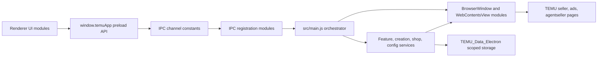
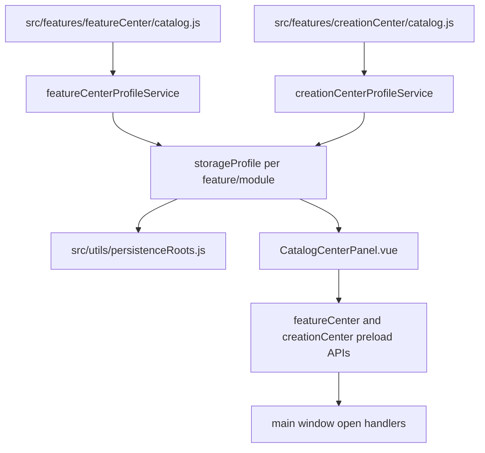
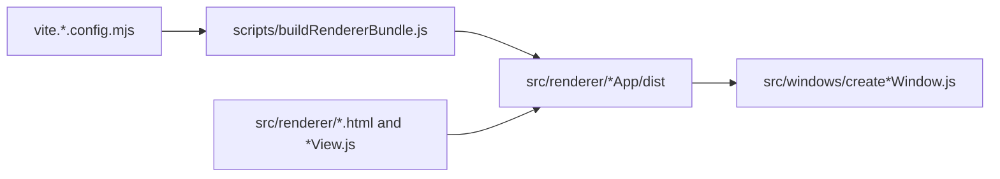

> generated_by: nexus-mapper v2
> verified_at: 2026-07-13
> provenance: AST-backed inventory plus manual dependency inspection. CommonJS require edges are not fully captured by query_graph.py, so diagrams are inferred from source inspection.

# Dependencies

## Runtime Flow

## Catalog And Storage Flow

## Renderer Bundle Flow

## Important Direction Rules

- Renderer code should call only preload bridge APIs, not Electron or Node directly.
- Main-process service orchestration should remain behind IPC handlers and service modules.
- New complex UI should be a renderer Vue module or independent renderer entry, not a main-process HTML string.
- Feature catalog entries define storage and action metadata. Do not bypass catalog/profile services for new feature-scoped persistence.
- Browser automation helper scripts should be bundled/injected from main-process window modules or services, not loaded from localhost by default.

## Query Graph Limitations

`query_graph.py` currently reports low internal dependency fan-in/fan-out because many modules use CommonJS `require` and Vue SFC internals have module-only coverage. Use the graph for file inventory and ES module clues, then verify CommonJS callers with `rg`.
